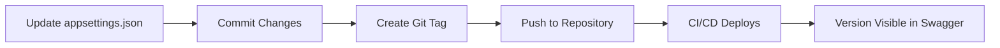

# ? Semantic Versioning Implementation Complete

## ?? What Was Implemented

Your API now displays **semantic versioning** (e.g., `v1.23.1`) prominently in Swagger UI and throughout the application.

## ?? Where the Version Appears

### 1. **Swagger UI** - Most Visible
- **Browser Tab Title**: "Base API - v1.23.1"
- **Page Title**: Shows next to API name
- **Green Badge**: Prominent version badge next to title
- **Endpoint**: `/swagger`

### 2. **API Version Endpoint**
```http
GET /api/v1/version

Response:
{
  "apiVersion": "1.23.1",
  "apiName": "Base API",
  "assemblyVersion": "1.0.0.0",
  "buildDate": "2024-01-28T10:00:00Z",
  "environment": "Development",
  "frameworkVersion": "10.0.0"
}
```

### 3. **HTTP Response Headers**
Every API response includes:
```
X-API-Version: 1.23.1
```

### 4. **Application Logs**
Startup logs show:
```
[INF] API Version: 1.23.1
[INF] ?? Application started successfully - Version: v1.23.1 ??
```

### 5. **Swagger JSON**
OpenAPI specification includes version:
```json
{
  "openapi": "3.0.1",
  "info": {
    "title": "Base API",
    "version": "v1.23.1"
  }
}
```

## ?? How to Update the Version

### Simple Method (Recommended)

**Edit one file:** `BaseAPI/appsettings.json`

```json
{
  "ApiSettings": {
    "ApiVersion": "1.24.0"  ?? Change this line only!
  }
}
```

That's it! The version will update everywhere automatically.

## ?? Files Created/Modified

### New Files:
1. ? `API/Configuration/ApiSettings.cs` - Configuration class
2. ? `API/Controllers/V1/VersionController.cs` - Version endpoint
3. ? `VERSION_MANAGEMENT.md` - Complete versioning guide
4. ? `VERSION_QUICK_START.md` - Quick reference
5. ? `SEMANTIC_VERSIONING_IMPLEMENTATION.md` - This file

### Modified Files:
1. ? `Program.cs` - Added version configuration and display
2. ? `appsettings.json` - Added version settings
3. ? `appsettings.Development.json` - Added dev version

## ?? Visual Features

### Swagger UI Enhancements:
- **Green version badge** next to API title
- **Custom styling** for version display
- **Version in browser tab** title
- **Version in page header**

### Example:
```
Base API                          [v1.23.1]
                                  ? Green badge
```

## ?? Semantic Versioning Rules

Format: `MAJOR.MINOR.PATCH`

| Version Type | Example | When to Use |
|-------------|---------|-------------|
| MAJOR | 2.0.0 | Breaking changes |
| MINOR | 1.24.0 | New features (backward compatible) |
| PATCH | 1.23.2 | Bug fixes |

### Pre-release Versions:
- `1.24.0-dev` - Development
- `1.24.0-beta.1` - Beta testing
- `1.24.0-rc.1` - Release candidate

## ?? Quick Start

1. **Update Version**:
   ```json
   // appsettings.json
   "ApiVersion": "1.24.0"
   ```

2. **Run Application**:
   ```bash
   dotnet run --project BaseAPI
   ```

3. **View in Swagger**:
   ```
   https://localhost:5001/swagger
   ```

4. **Verify Version Endpoint**:
   ```bash
   curl https://localhost:5001/api/v1/version
   ```

## ?? Documentation

- **Complete Guide**: See `VERSION_MANAGEMENT.md`
- **Quick Reference**: See `VERSION_QUICK_START.md`
- **This File**: Implementation summary

## ?? Testing the Implementation

### 1. Check Swagger UI
```
Navigate to: https://localhost:5001/swagger
Expected: Version badge displayed next to title
```

### 2. Check Version Endpoint
```bash
curl https://localhost:5001/api/v1/version
```

### 3. Check Response Headers
```bash
curl -I https://localhost:5001/api/v1/products
# Look for: X-API-Version: 1.23.1
```

### 4. Check Logs
```bash
# In application logs:
[INF] API Version: 1.23.1
```

## ?? Pro Tips

1. **Always tag releases** in Git:
   ```bash
   git tag v1.23.1
   git push --tags
   ```

2. **Use environment-specific versions**:
   - `appsettings.Development.json`: `"1.23.1-dev"`
   - `appsettings.Production.json`: `"1.23.1"`

3. **Automate version updates** in CI/CD:
   ```yaml
   # GitHub Actions example
   - name: Update version
     run: |
       VERSION=$(echo ${GITHUB_REF#refs/tags/v})
       jq '.ApiSettings.ApiVersion = "'$VERSION'"' appsettings.json > tmp.json
       mv tmp.json appsettings.json
   ```

4. **Monitor versions** in production:
   ```bash
   # Quick check deployed version
   curl https://your-api.com/api/v1/version
   ```

## ?? Benefits

? **Single Source of Truth**: One place to update (`appsettings.json`)  
? **Visible Everywhere**: Swagger, logs, headers, endpoints  
? **Environment-Specific**: Different versions per environment  
? **CI/CD Ready**: Easy to automate  
? **Client-Friendly**: Clients can verify API version  
? **Debugging**: Version in logs helps troubleshooting  
? **Documentation**: Version in OpenAPI spec  

## ?? Typical Workflow



1. Developer updates `appsettings.json`
2. Commits with message: `"chore: bump version to 1.24.0"`
3. Creates tag: `git tag v1.24.0`
4. Pushes to repository
5. CI/CD pipeline deploys
6. Version automatically appears in Swagger and everywhere else

## ?? Support

If version doesn't appear:
1. Check `appsettings.json` has correct format
2. Restart application
3. Clear browser cache
4. Check logs for configuration errors
5. Verify `ApiSettings` section exists

## ? Future Enhancements

Consider adding:
- [ ] Build number in version (e.g., `1.23.1+build.123`)
- [ ] Commit SHA in version info
- [ ] Changelog endpoint (`/api/v1/changelog`)
- [ ] Version comparison tool
- [ ] Deprecation warnings for old versions

---

## ?? Summary

**You can now display semantic versioning (v1.23.1) in your Swagger UI by simply updating one line in `appsettings.json`!**

```json
"ApiVersion": "1.23.1"  ?? Change this, restart, done!
```

**The version will automatically appear in:**
- ? Swagger UI (with green badge)
- ? API responses (header)
- ? Version endpoint
- ? Application logs
- ? OpenAPI specification

**No code changes needed for future version updates - just update the configuration file!** ??
